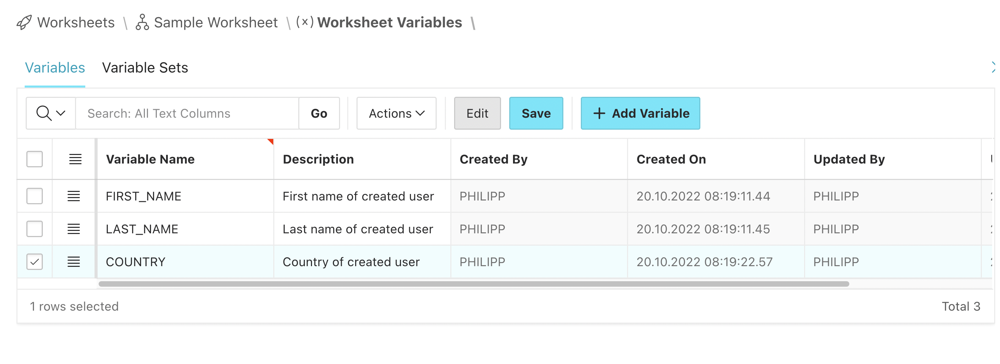
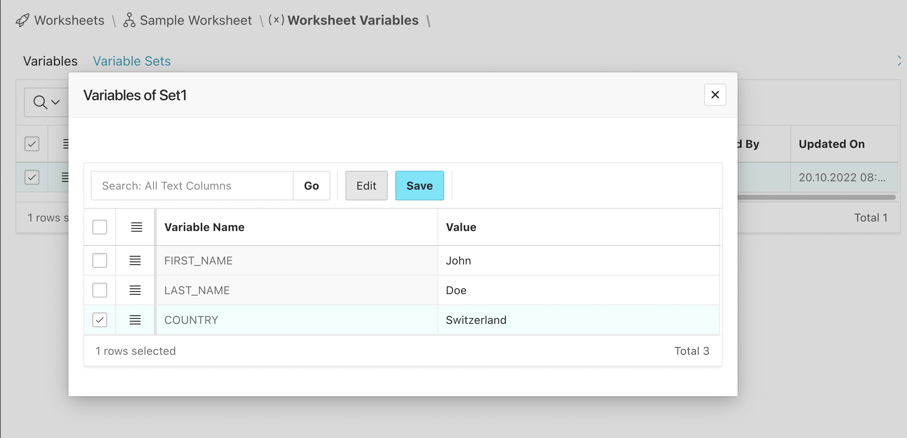
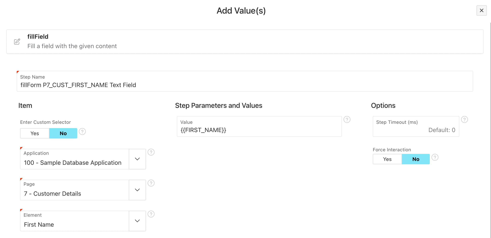

# Variables

Variables are a way to store sets of values in your worksheet. You can refrerence the variables in your steps and LCT will swap the variable name with the value.

:::tip

Use variables to fill data fields with a wide variety of input values. For example use different value lengths, special characters and language specific characters.

:::

## Creating variables and sets

On any Worksheet you can click the "Worksheet Variables" button to get to the variables editor. 

In there you can at first create variable defintions:

When this is done you can switch the tab to "Variable Sets" and add a new set of variables. After naming and saving it you can click on the link "Add Variables to Set".

You can add as many sets as you like.

## Using variables in steps

In a step in the same worksheet you can use the variables by typing the variable name surrounded by two pairs curly braces. In this example we use a fillField step with the variable reference `{{FIRST_NAME}}`:

## Test executions

When you click "Run Worksheet" you get the option to manually select a variable set. If you don't select any a random one will be used.

In automatically executed Test Suites a **random set of variables is used**.

:::danger Variables are not constants

Variables are randomly selected for each test suite test execution. This means that you should not put things that should not change like login credentials or selectors in there.

:::

## What happens if you mistype a variable name

It just won't get replaced. In your test the literal text like `{{FIRSST_NAME}}` appears. So when you see this you will know that there is a typo.
