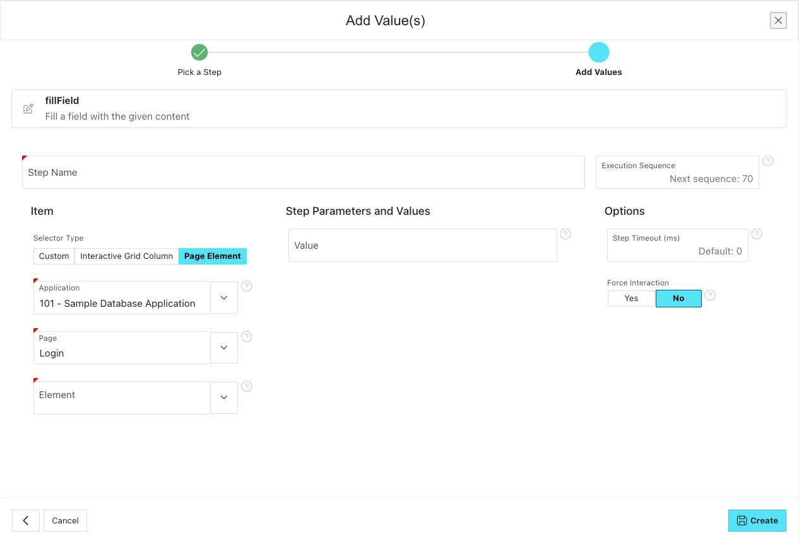
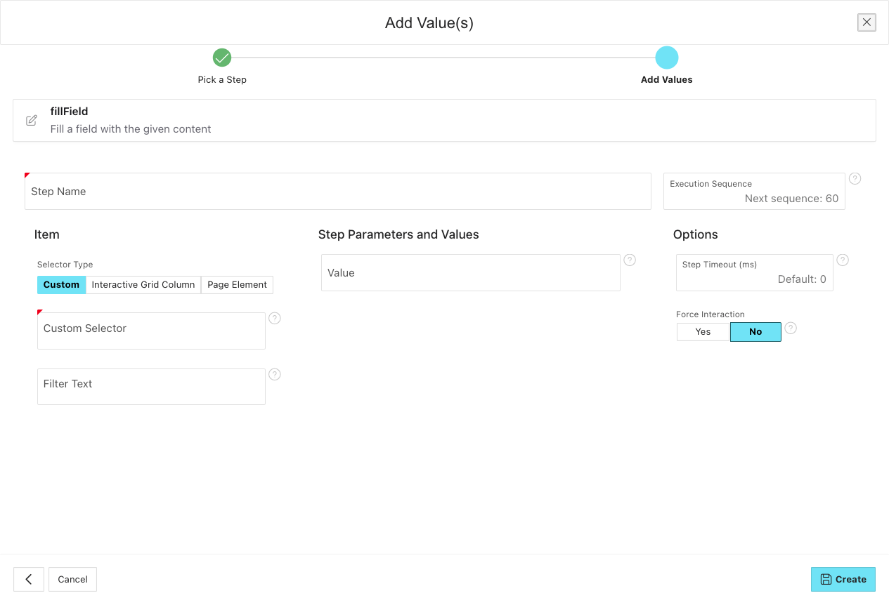
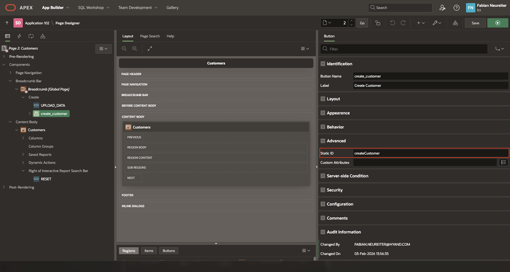
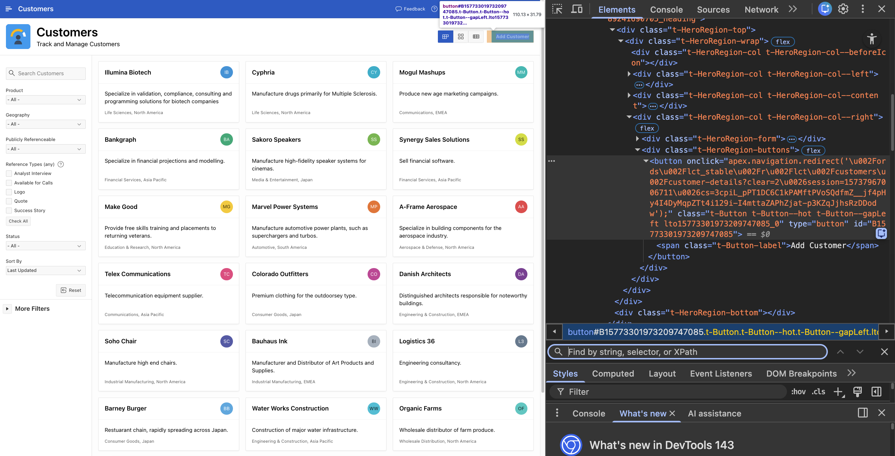

# Selectors

We usually try to generate the selectors for the elements you want to interact with based on the metadata that APEX saves about them in the database when creating said element. This is what happens in the background when you select "Page Element" or "Interactive Grid Column" as the selector type when adding a step.

There are scenarios where a custom selector can be necessary. Those scenarios mainly involve testing applications with non-standard APEX components, like plugins or other custom HTML constructs.
In these cases, we can't derive the selectors from the metadata. This, however, does not mean that we cannot interact with the specific elements. We just have to let LCT know how it can find the elements in the DOM by using a custom selector, meaning a selector not generated by LCT.
For that reason, some helpers allow for the input of custom selectors to find the element you want to interact with.

## Supported selector types

LCT supports the following selector types:

- **CSS Selector**: A CSS selector is a string that identifies elements in the DOM based on their CSS properties, such as class names, IDs, attributes, and hierarchical relationships. For example, `.my-class`, `#my-id`, or `div > span[attr='value']`.
- **XPath**: XPath is a language for navigating through elements and attributes in an XML document. It can be used to select nodes in an HTML document as well. Examples include `//div[@class='my-class']` or `/html/body/div[1]/span`.

When using custom selectors, ensure they are specific enough to uniquely identify the desired element to avoid ambiguity during test execution.

### CSS Selectors

When using CSS selectors, you can leverage various attributes of HTML elements to create precise selectors. Here are some common patterns:

- **By ID**: `#element-id`
- **By Class**: `.element-class`
- **By Attribute**: `[attribute='value']`
- **By Hierarchy**: `parent > child` or `ancestor descendant`
- **By Pseudo-classes**: `:first-child`, `:last-child`, `:nth-child(n)`

### XPath Selectors

XPath selectors provide a powerful way to navigate the DOM structure. Here are some common XPath patterns:

- **By Element Name**: `//tagname`
- **By Attribute**: `//tagname[@attribute='value']`
- **By Hierarchy**: `/html/body/div[1]/span` or `//div[@class='parent']//span`
- **By Position**: `(//tagname)[n]` (selects the nth occurrence of the tag)
- **By Text Content**: `//tagname[text()='exact text']` or `//tagname[contains(text(),'partial text')]`

:::info

Although finding an element by its text is unique to XPath, we have added the possibility to use a custom CSS selector and still find it by its text content. Just enter your custom CSS selector in the "Custom Selector" input field and then enter you text in the "Filter Text" input field that appears below it.

:::

## Good Practices

- Always test your custom selectors in a browser's developer console to ensure they correctly identify the intended elements before using them in LCT.
- Prefer more specific selectors to avoid selecting multiple elements unintentionally. **In LCT, custom selectors have to point to exactly one element**.
- Keep your selectors as stable as possible. Make sure that your selectors do not heavily rely on attributes that are prone to change as the application under test evolves. Try to avoid using a strict hierarchy if the DOM structure is likely to change, like when using `div > span > a`. Try also to avoid using auto-generated IDs, like `#B15773301973209747085` for a button, or classes that might change between application versions. When using classes, try to avoid those that set a specific color or size, as those are more likely to change. Instead, try to find classes that indicate the purpose of the element, like `t-Button--primary` for a primary button in APEX. Supplying your central elements on a page with static ids can help mitigate this.

:::info

Set your own Static IDs for regions, interactive grid columns, buttons, and other elements in your APEX application.
Static IDs defined in the APEX App Builder will replace the autogenerated IDs and make it easier to create stable selectors.
See the example for a button below:

This replaces the autogenerated ID for the button element `<button type="button" id="B7356180051404056641">Create Customer</button>` with `<button type="button" id="createCustomer">Create Customer</button>`, making it much easier to create a stable selector.

:::

## Using a browser's developer tools to find selectors
Most modern browsers come with built-in developer tools that allow you to inspect the DOM and find selectors for elements. Here's how you can do it in popular browsers:

### Copying selectors using browser developer tools
- **Google Chrome**:
  1. Right-click on the element you want to inspect and select "Inspect".
  2. In the Elements panel, right-click on the highlighted HTML code and choose "Copy" > "Copy selector" for CSS selectors or "Copy" > "Copy XPath" for XPath selectors.
- **Mozilla Firefox**:
  1. Right-click on the element and select "Inspect Element".
  2. In the Inspector panel, right-click on the highlighted HTML code and choose "Copy" > "CSS Selector" or "XPath".
- **Microsoft Edge**:
  1. Right-click on the element and select "Inspect".
  2. In the Elements panel, right-click on the highlighted HTML code and choose "Copy" > "Copy selector" or "Copy XPath".
- **Safari**:
  1. Right-click on the element and select "Inspect Element".
  2. In the Elements panel, right-click on the highlighted HTML code and choose "Copy Selector" or "Copy XPath".
  3. (Note: You may need to enable the Develop menu in Safari's preferences to access the Inspect Element option.)

:::caution

The good practices mentioned above still apply. A browser-generated selector might not be the most stable one. Always review and adjust the selectors as needed to ensure they are robust and maintainable.

:::

### Validating selectors
After copying a selector or creating it by hand, it's a good practice to validate it to ensure it correctly identifies the intended element:
1. Open the browser's developer console and bring up the search field by pressing `Ctrl + F` (or `Cmd + F` on Mac).
2. Paste the copied selector into the search field.
3. If the selector is valid, the corresponding element will be highlighted in the DOM.
4. If multiple elements are highlighted, refine your selector to make it more specific.

