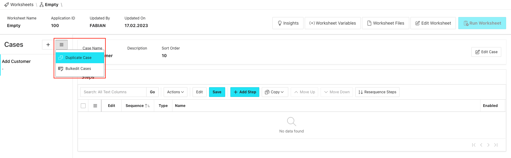
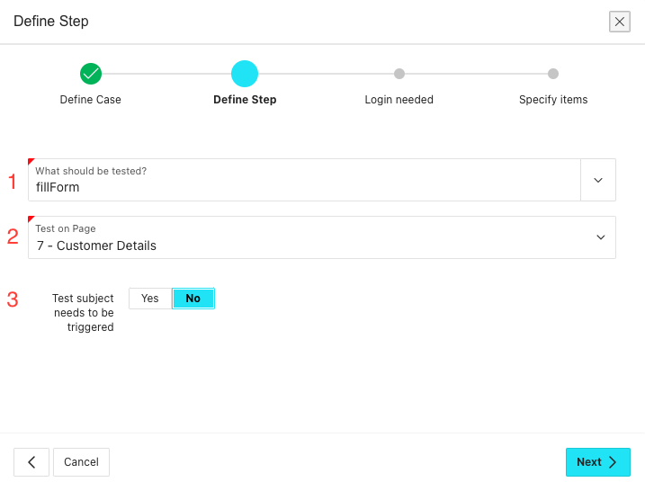

# Test Cases {#test-cases}

A test case is a specific scenario designed to verify whether a particular aspect of your application is working correctly. In the case of the Sample Database Application, a Test Case could be adding a customer or placing an order.

:::note

Except for BeforeEach- and AfterEach-Cases, Test Cases in LCT are __independent of one another__. This means that the execution of one Test Case does not influence the execution of another Test Case. Each Test Case starts without any page loaded.

::: 

## Creating a Test Case {#create-case}

Test Cases can be created in numerous ways in LCT:
* As an empty (meaning containing no Test Steps) Test Case of a specific type:
  * Standard
  * BeforeEach
  * AfterEach
* As a __copy__ of a Test Case in another worksheet
* As a __duplicate__ of an existing Test Case in the current Worksheet
* Via a __wizard__, using __templates__ to directly add Test Steps to it

Assuming a Worksheet has already been created, adding a Test Case is easy. 
First, go to the Worksheet you want to add cases to by clicking the Row Menu for the specific Worksheet on the LCT main page and click 'Go to Worksheet':

### Creating an empty Test Case {#create-empty-case}

If the Worksheet is empty (meaning that it contains no Test Cases), the easiest way to add an empty test case is by clicking the plus-icon in the Test Case list section on the left hand side:

This will trigger the following dialog where 'Empty Case' can be selected:

:::note

If Test Cases already exist within our worksheet, we can trigger the same dialog by clicking the plus-icon next to the 'Cases'-header in the Test Case list section: 

::: 

After selecting 'Empty Case', in the next dialog page several can and have to be given:

1. A __name__ that idealy best describes the functionality this case will test. Although it is not mandatory to choose a unique Test Case name, it is recommended.
2. The __type__ of the Test Case
     * __Standard__ (default)
     * BeforeEach/AfterEach   
     'Standard'-cases are Test Cases that are executed once in a Worksheet, one after the other.   
     BeforeEach/AfterEach-cases are either executed before or after each case in the current Worksheet. Test Steps that apply to all Test Cases, like steps to perform a login, can be idealy placed inside one of those types.
3. A __description__. As for Worksheet descriptions, this is an optional field, that serves as a container for information about that Test Case. It is recommended to make use of it because it makes it easier for the whole testing team to know what is will be tested by that in case in more detail.
4. As with the description field, the __'Prerequisites'__-section also only has an informational character. It is recommended to insert information here that explain what the requirements are for the execution of the Test Case (testdata preparation endpoints exist, testuser exist etc.).

To finish, click the 'Create Case'-button.

### Create a Test Case as a copy of an existing one {#case-as-copy}

Sometimes, you might want to use an existing Test Case as a jumping off point when creating a new one. For this, we have the option to create a Test Case as a copy of a Test Case in a different Worksheet.
To do that, trigger the 'Add Case'-dialog in one of the ways descibed in [Creating an empty Test Case](#create-empty-case) and then select 'Case as Copy':

In the following dialog, first select the Worksheet you want to copy from. The list contains all the Worksheets in this LCT instance.   
After choosing the Worksheet, a list of the cases in that Worksheet will appear. To select the Test Case(s) to copy, click the row selector for the corresponding Test Case(s). To finalize copying, click the 'Copy'-button. 

### Duplicate a Test Case {#duplicate-case}

Test Cases can be also be duplicated, meaning creating one as a copy of a case in the current Worksheet. To do that, click on the Test Case that should be duplicated to select it and then either
* click the menu icon in the cases header of the Test Case list section and choose 'Duplicate'   
  
* or right click a Test Case and choose 'Duplicate'   
  

### Add Case via wizard and template {#case-via-wizard}

LCT offers the possibility to add Test Case while also directly adding the necessary Test Steps for specific Use Cases. 
This is done by using __Templates__. At the moment, there are two templates, one for creating steps to perform a login ('Login') via APEX Standard Authentication and one for the interaction with form elements ('fillForm').

#### Adding a Test Case via fillForm-template

In order to showcase this feature better, we will be creating a case with some steps to test the functionality of adding a customer in the APEX Productivity App 'Sample Database Application'.

To add a Test Case via a template, trigger the 'Add Case'-dialog in one of the ways described before.
Then, click 'Case via Wizard':

In the following dialog, the same information can be given as in the '[Creating an empty Test Case](#create-empty-case)'-section. To continue to the next page of the current wizard, click the 'Create and add Steps'-button:

In the next wizard page, some information has to be provided:

1. __What should be tested?__   
   In this Popup Lov, the template to create the steps can be chosen. Select 'fillForm'.
2. __Test on page__   
   Here, the page the form is on can be selected. As an example, for adding a customer in the Sample Database Application, page 7 would be selected.
3. __Test subject needs to be triggered__   
   Set this to 'Yes', if the form we want to generate the steps for is located within an iframe.   
   If set to 'Yes', provide information for:

   

   1. __Trigger is on Page__   
     The page the element that opens up the form we want to test is on. For the Sample Database Application, it would be page two.
   2. __Triggering element__   
    The element that opens up the form we want to test. For the Sample Database Application, it would be the 'Create Customer'-button.
   3. __Triggering action__   
    The action that should be performed on the triggering Element. Here, it would be click or doubleClick.

To proceed, click the 'Next'-button.

In the next wizard page, we will be selecting wether to generate additional Login-Steps or not.

To do that, set 'Login needed' to 'Yes'. Once this is done, the Login Page is automatically detected and we see an Interactive Grid containing all the elements on the Login-page that we can generate steps for:

This is the corresponding page in the Sample Database Application:

Now, we have to define which values we want to insert into the given items and what actions we want to perform on them.   
For the Text- and Password-Fields, we could enter 'sample_user' and 'samplePassword' in the 'Value'-column for example:

As the action that should be performed on the respective element, select 'fillField'.

:::note

The available actions are dependent upon the elements type. Input fields have 'fillField', select lists have 'selectOption', buttons have 'click' and so on. These actions map directly to the steps you would create manually for interacting with those elements.

::: 

Buttons can't receive values, so we only have to select an action, 'click'.

To proceed, click the 'Next'-button:

On the next wizard page we again see an Interactive Grid, this time containing all the elements of the form we want to test on page 7. 
The same approach of entering Values and choosing actions applies here as well.
As an example, we provide data only for the elements which are required:

Don't forget to provide an action for the button that submits the form. 

As a reference, this is the page in the Sample Database Application:

To create the case and all of the steps, click 'Finish'.

After the dialog has closed, we see our newly created case with all the necessary Test Steps, including ones to navigate to the respective pages, to switch the test context to an iframe and the steps to interact with the form items:

## About _Before Each_ and _After each_ cases {#about-before-after-each}

A _Before each_ case is a collection of steps that will be performed before each individual test case.
Usually, it is used to perform steps to login into the application, to open the page where all use cases start or to call an API for data preparation.
Likewise, a _After each_ case is a collection of steps that will be performed after each individual test case.
For example, you could use them for data cleanups or for assertions that should be checked for all test cases.
Both special case types are not listed individually in test executions.
Instead, steps are executed just before or after steps of normal cases.
