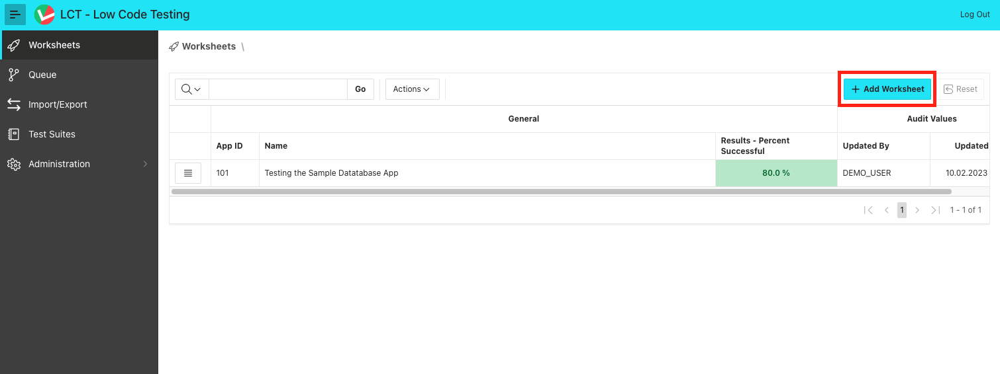
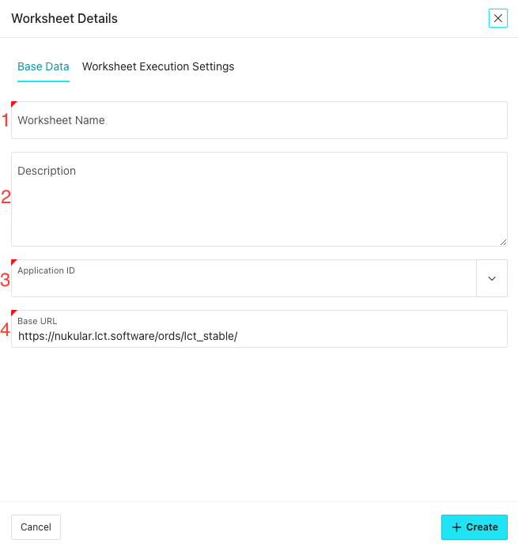
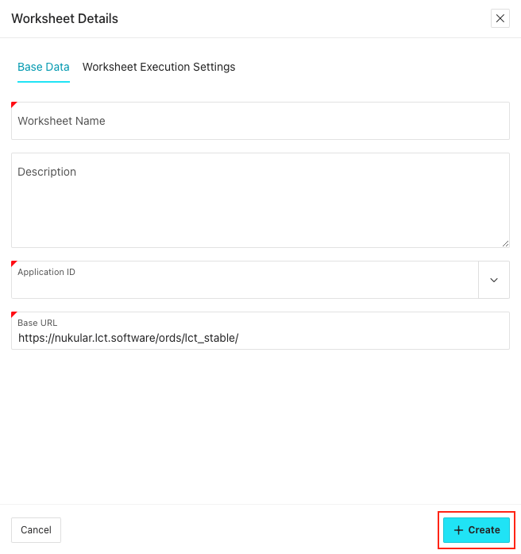

# Worksheets

In LCT, Worksheets bundle specific [Test Cases](./test-cases.md) that are executed together. They are the basic building blocks of LCT. You can create a Worksheet for a specific application or for a specific section of an application.

Worksheets are comparable to database packages. A package bundles a set of functions that are related to each other. In the same way, a Worksheet bundles a set of test cases that are related to each other.

## Worksheet overview

The page _Worksheets_ displays all worksheets existing in the current LCT instance.

The table has the following columns:

-   Actions menu
    -   _Go to Worksheet_: Opens the case and step editor for this Worksheet.
    -   _Run Worksheet_: Opens the _Schedule Test_ dialog for planning a test run.
        -   Note: This button is only enabled if the Worksheet can be run.
        -   Read more about [text executions](./test-execution.md).
    -   _Edit Worksheet_: Opens a dialog where Worksheet details can be edited.
-   App ID
    -   The application that is tested by this Worksheet
-   Name
    -   The unique name of the Worksheet
-   Results - Percent Successful
    -   The percentage of successful test executions within the last 20 runs
-   Status
    -   Shows a pie chart icon indicating the percentage of successful test executions within the last 20 runs. The chart rounds to 5% steps.
-   Tags
    -   All Worksheet Tags assigned to this Worksheet, sorted by name
-   Created By
    -   The name of the user that created this Worksheet
-   Created On
    -   The date and time the Worksheet was created
-   Updated By
    -   The user that last edited the Worksheet
-   Updated On
    -   The date and time the Worksheet was last edited

The _Results_ and _Status_ columns use the following color scheme:

| Range               | Color  |
| ------------------- | ------ |
| < 40%               | red    |
| &geq; 40% and < 80% | yellow |
| &geq; 80%           | green  |

Above the table, the _Worksheet Filter_ region can be expanded.
If the _Worksheet Tag_ filter is used, Worksheets must have at least one of the selected tags assigned in order to be displayed.
Additionally, you can use the Interactive Grid settings provided by APEX to filter, sort or format the table.

## Creating a Worksheet

To create a Worksheet, simply click 'Add Worksheet' on the LCT Home Page:

On the dialog page, some information can or must be given:

1. **Worksheet Name** _(required)_
   A name that uniquely identifies your Worksheet.
2. **Description** _(optional)_
   A description of what happens in that Worksheet. Solely for informational purposes.
3. **Application ID** _(required)_
   Choose the application that should be tested by that Worksheet. In that Popup LOV, all the applications where metadata view access is availlable to the LCT-Schema.

    :::note

    Choosing an application here, does **not** mean that you can't navigate to or interact with other applications in this Worksheet. The application defined only serves as a starting point and is used for the step creation templates.

    :::

4. **Base URL** _(required)_
   The Base URL that all navigations depend upon in this worksheet. It is defined here so that this Worksheet can be easily exported into a different LCT instance in another environment, like another test environment where the application under test is also installed. In this case, only the base url has to be changed once instead of in every navigation step.

To finish the Worksheet creation, click 'Create':

