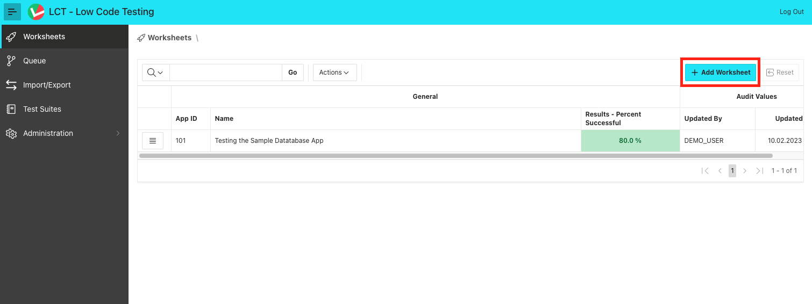
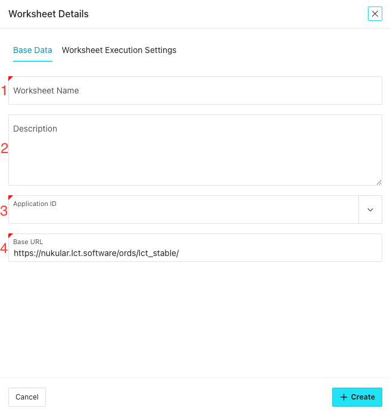
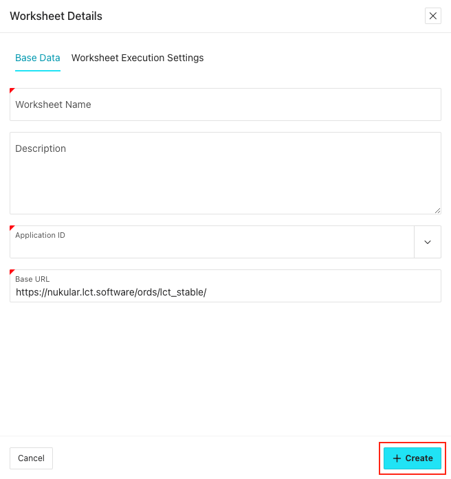

## Worksheets
In LCT, Worksheets map to the application you want to test. If you want to test the Sample Database Application (APEX Productivity App)for Example, you would create a Worksheet for it.

To create a Worksheet, simply click 'Add Worksheet' on the LCT Home Page:

On the dialog page, some information can or must be given:

1. __Worksheet Name__  *required*  
   A name that uniquely identifies your Worksheet.
2. __Description__ *optional*  
   A description of what happens in that Worksheet. Solely for informational purposes.
3. __Application ID__ *required*   
   Choose the application that should be tested by that Worksheet. In that Popup LOV, all the applications where metadata view access is availlable to the LCT-Schema.  
   :::note

   Choosing an application here, does __not__ mean that you can't navigate to or interact with other applications in this Worksheet. The application defined only serves as a starting point and is used for the step creation templates.

   :::     
4. __Base URL__ *required*   
   The Base URL that all navigations depend upon in this worksheet. It is defined here so that this Worksheet can be easily exported into a different LCT instance in another environment, like another test environment where the application under test is also installed. In this case, only the base url has to be changed once instead of in every navigation step. 

To finish the Worksheet creation, click 'Create':

