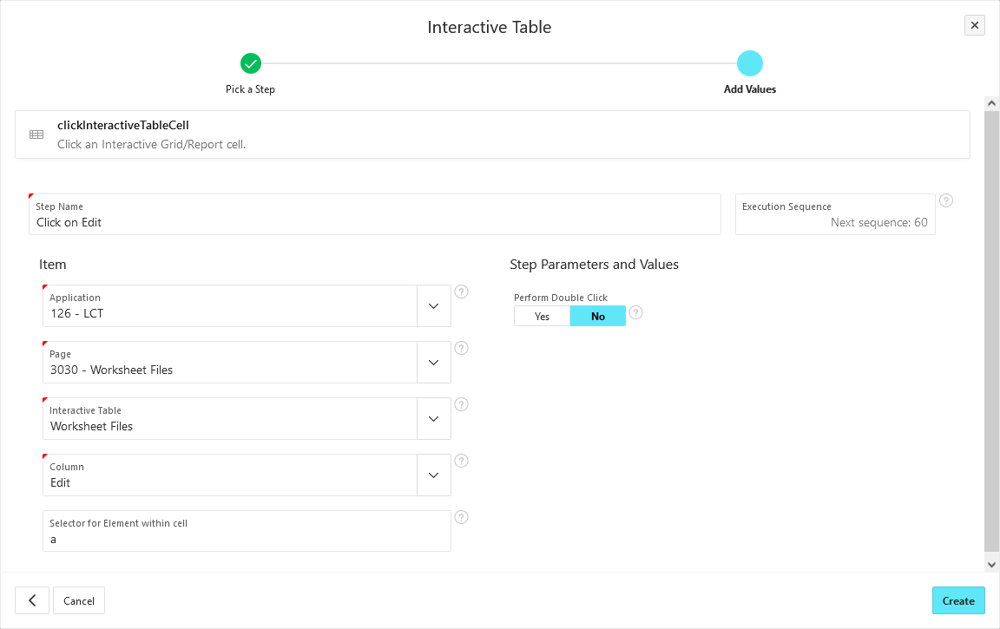

# clickInteractiveTableCell

Click an Interactive Grid/Report cell.

:::info

This step interacts with the first row of the selected Interactive Grid/Report.
Use the [filterInteractiveTable step](filter-interactive-table.md) to choose the row to interact with.

:::

## Interact with an element within the cell

This step can interact with different types of columns.
For example, if you want to click on a link, set _Selector for Element within cell_ to `a`.

## Perform a double click

If you want to perform a double click instead of a single click, set _Perform Double Click_ to _Yes_.
This can be useful if you want to enter the edit mode of an Interactive Grid.
