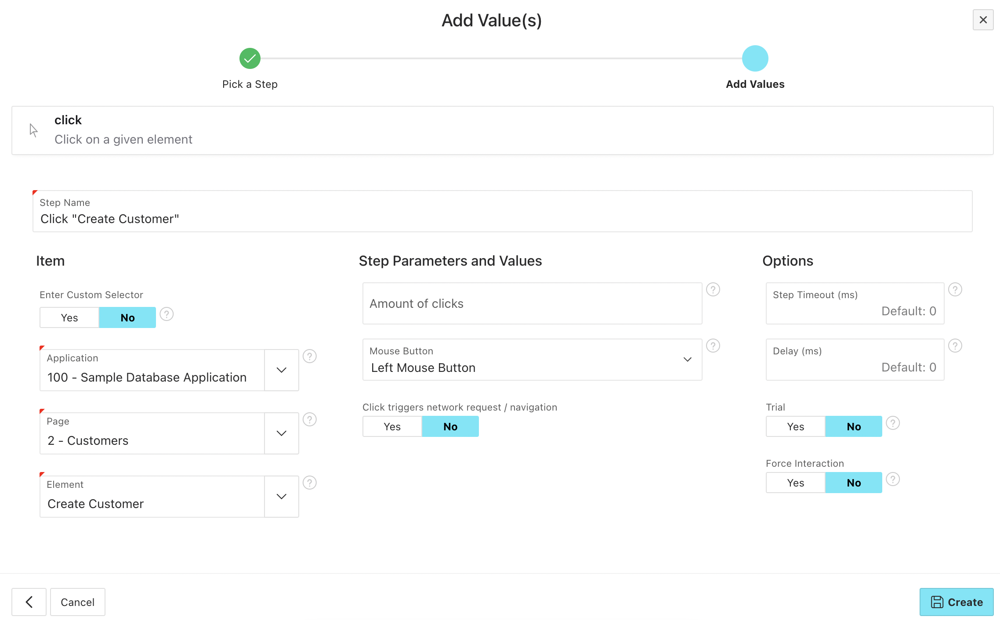

# Click

Use this step to click on elements in the DOM.

You have the option to enter a custom selector or use the dropdowns to select an element on your page from the APEX metadata.

## Wait for network requests after the click

You can use the option "Click triggers network request / navigation" to automatically wait until all network requests are finished after clicking on an element. This is useful if your click triggers for example a navigation to another page, a modal page to load or a data report to refresh.

## Only check if a button can be clicked without clicking it

If you want to check if a button can be clicked without actually clicking it, you can use the option "trial". This will check if the button is in the DOM visible, not disabled etc.

:::tip

This can be useful to check authorization schemes. If you log in with a privileged user you can quickly also check that he has access otherwise hidden / disabled buttons without actually clicking them.

:::
