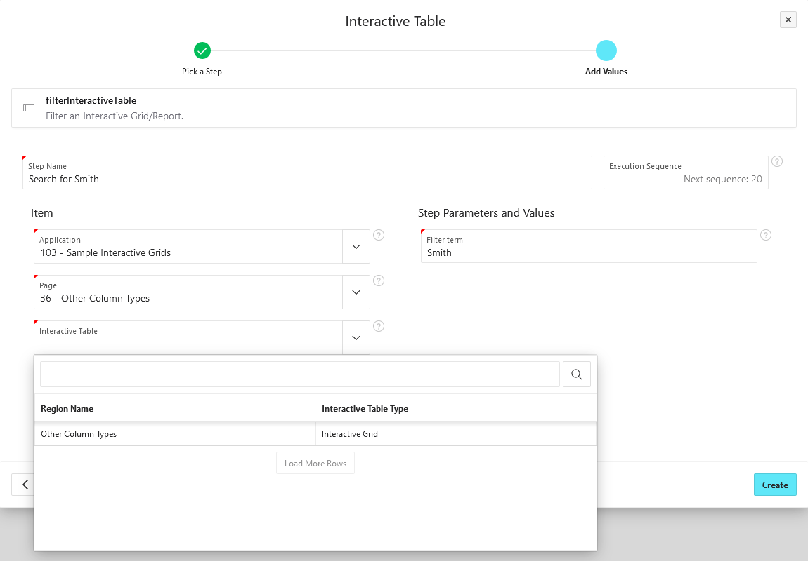

# filterInteractiveTable

Filter an Interactive Grid/Report.

## Basic usage

First, choose an Interactive Grid or Interactive Report from the APEX metadata.
Then enter your search term to be inserted into the search bar of the table.

If the region has not a search bar, the test case will fail.

:::tip

This step is commonly used with other Interactive Grid/Report steps, such as the [clickInteractiveTableCell step](./click-interactive-table-cell.md).

:::
