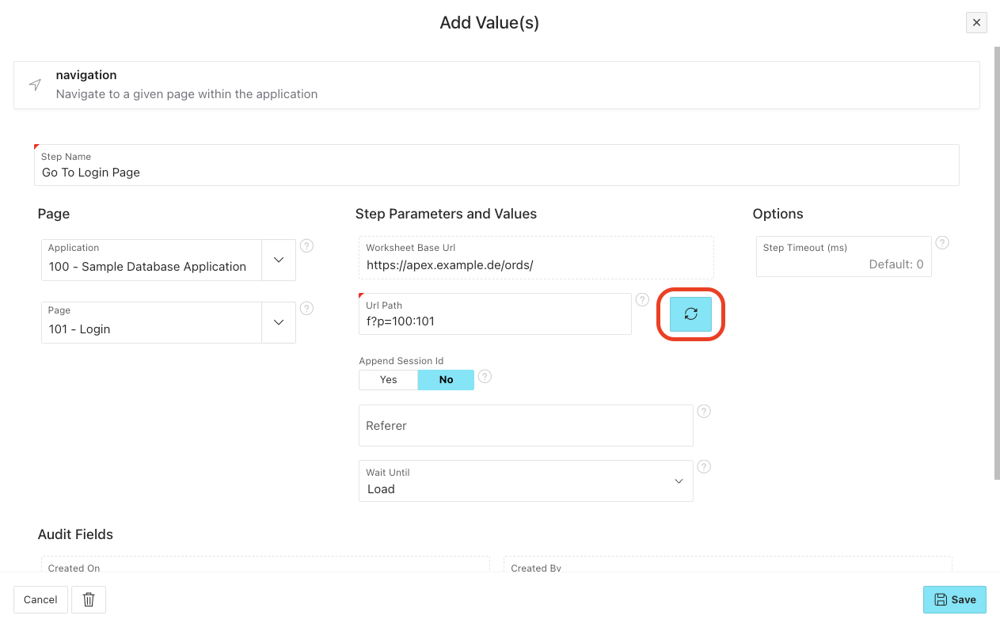

# Navigation

Navigate to a specific page in your application.

## Usage

Select your desired Application and Page from the dropdowns. After that make sure to press the refresh button to generate the URL path:

## Keep current user session

As you may know the default APEX behaviour is to log out the user when changing the URL without keeping the session parameter.

If you **don't** want this to happen just set `Append Session ID` to `Yes`. This will automatically append the session parameter to the URL.
