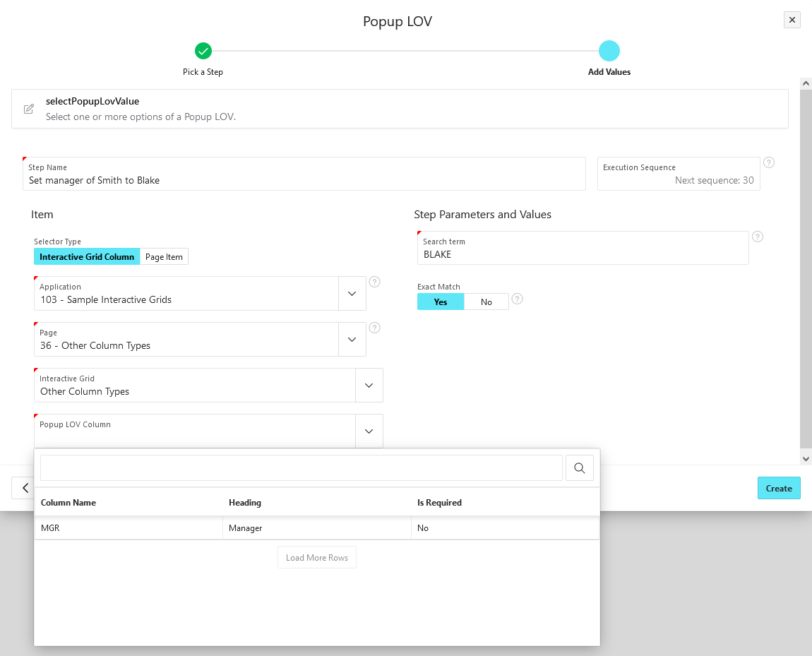

# selectPopupLovValue

Select one or more options of a Popup LOV.

## Basic usage

You have two options to choose an element from the APEX metadata:

- **Page Item**: The Popup LOV is located on the page.
- **Interactive Grid Column**: A column on a Interactive Grid region is set to Popup LOV.

Then enter your search term to be inserted into the search bar of the Popup LOV.

If the search term cannot be found while executing the worksheet, the test case will fail.

:::note

To select multiple values of a Multi Value Popup LOV, create one step for each individual value.

:::

## Exact match

By default, the step selects the value that exactly matches the search term.
If you want to search only a part of the string, such as "BL", set _Exact Match_ to _No_.
Then the first search result will be selected.

If _Exact Match_ is set to _Yes_, then the search is case sensitive, otherwise it is case insensitive.
