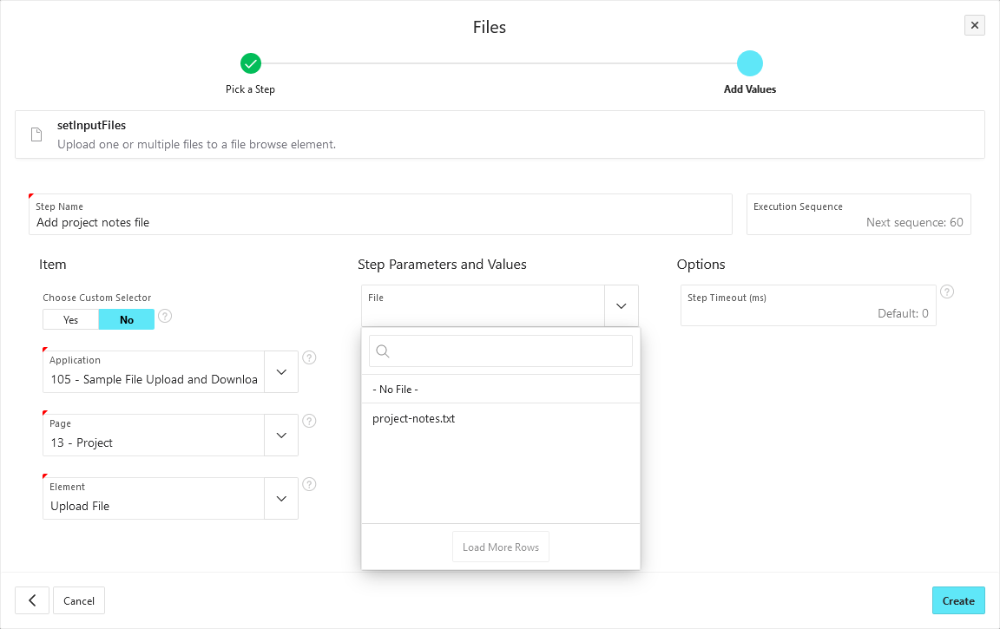

# setInputFiles

Upload one or multiple files to a file browse element.

:::info

You have to provide the files you want to test with before they can be selected.
Files for this step can be uploaded on the _Worksheet Files_ page.

:::

You may use the dropdowns to select an element from the APEX metadata or enter a custom selector.

Then choose a file for uploading.
If you have selected a page item that supports uploading multiple files, you can select multiple files in this step as well.

Optionally you can set a step timeout in milliseconds.
