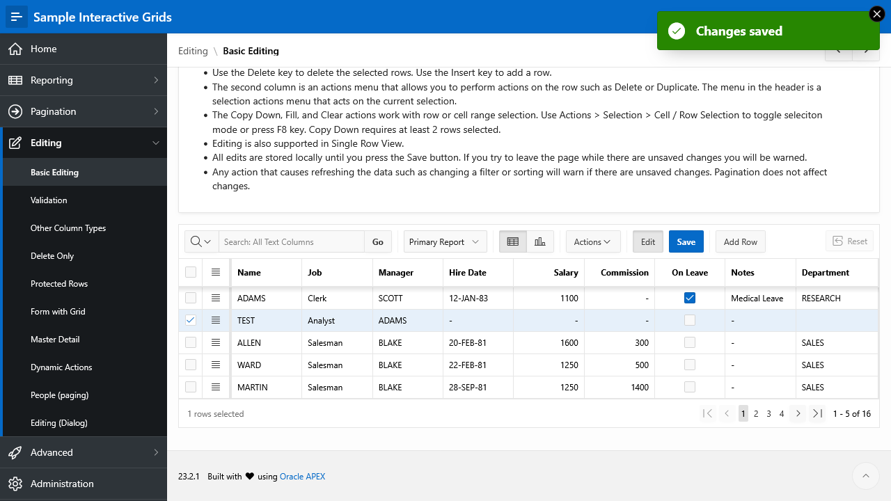

# Create your first worksheet

We assume that you have installed the _Sample Interactive Grids_ application for which we want to write a simple test.
Additionally, we assume that login credentials for a test user within your Oracle APEX instance are available.

:::info

We use Application ID 101 for our sample application.
Depending on your installation that number can be different.

:::

## Inspect the application

Before we write our test definition, let's explore the use case we want to reproduce!
Imagine an application where an end user wants to add employee data to a table.
We use the _Sample Interactive Grids_ application which demonstrates various _Interactive Grids_ which are common in Oracle APEX applications.

1. Open the application
    - If you have developer access to Oracle APEX, open the _App Builder_ and click on the _Run_ button next to the application name. The application will open in a new browser tab. 
      
    - If not, ask your admin about the URL.
2. Enter your credentials and click _Sign In_.
3. Click on the icon in the top left corner to open the navigation menu. 
    
4. Click on _Editing_ and then on _Basic Editing_
5. In the table, click on _Add Row_. A empty row will be added to the table and the cursor will be added in the _Name_ column.
6. Enter the following information into the table row:
    - Name: `TEST`
    - Job: `Analyst`
    - Manager: `ADAMS`
7. Click on _Save_ to apply the changes
8. A message box with the text _Changes saved_ appears. It indicates that the data was successfully saved.

If you want to delete the row, use the menu icon which is located to the left of the _Name_ column and select _Delete Row_.
Then save your changes again by clicking the _Save_ button.

## Create a Worksheet

_Worksheets_ are collections for test cases and the top-level elements of LCT.
Usually, a Worksheet is created for each individual application or module that shall be tested.

After logging into LCT using your developer account, you will see the _Worksheets_ page.
In the buttons row above the table, click on _+ Add Worksheet_.

In the dialog, enter the following information:

-   Worksheet Name: _Sample Interactive Grids_
-   Application ID: _101 - Sample Interactive Grids_

Click on _+ Create_. The dialog closes and the Worksheet appears in the table.
Select _Go to Worksheet_ from the menu icon on the left side for the row.
The case editor will be opened.

## Add a test using the wizard

Let's imagine we have a use case where a user wants to add employee data to a table.

Various actions must be performed:

-   Log in into the app
-   Navigate to the edit page
-   Enter and save the data

The use case will be represented and tested by a _Test Case_ in LCT.
We recommend writing exactly one test for each use case to avoid expensive changes if the application changes in the future.
A test case consists of various test steps.
_Steps_ are the individual actions that will be performed on the page when the test runs.

After each dialog page, click on _Next_ to go to the next page.

1.  Click on _+_ to add a new test case
    -   Note: If the Worksheet is empty, you can use the green _+_ button. Otherwise, the button next to the _Cases_ label is always available.
2.  In the dialog, choose _Case via Template_
3.  An wizard with multiple steps opens. Enter the following information in the following dialog pages. After adding all values within a page, click on _Next >_ to go to the next one (exception for step 1: _Create and add Steps >_) . Pay attention to the values which we have entered when exploring the application manually.
    1.  Define Case
        -   Name: Basic Editing
    2.  Choose Template
        -   Application: 101 - Sample Interactive Grids
        -   What should be tested?: Add a row to an IG
        -   Test on Page: Basic Editing
    3.  Define Login Steps
        -   Login Needed: Yes
        -   Login Page: 101 - Login
        -   Username: (The username of your test account)
        -   Password: (The password of your test account)
        -   Login Page Buttons - Choose Button to Click: Sign In
    4.  Set Modal Trigger
        -   Page to test is a modal and needs to be triggered: No
    5.  Define Steps for adding an IG Row
        -   Interactive Grid: Basic Editing
        -   Type the following strings in the column _Value_:
            -   Name: `TEST`
            -   Job: `Analyst`
            -   Manager: `ADAMS`
        -   Add Click-Step for Add Row-Button: Yes
        -   Add Click-Step for Save-Button: Yes
        -   Note: You don't need to change the default values for both buttons

Now click on _Finish_. The test case will be created and appears in the list on the left.
Select it to open the corresponding steps.
The wizard has created a sequence of steps based on our input in the dialog pages.

## Add some additional test steps

The wizard is very useful for defining the general structure of a test.
But we also want to further adapt our test case to our application.

First, let's add an assertion step for checking that no error message has occurred:

1. In the steps grid, click on _+ Add Step_
2. Select _checkForErrors_ from the list
3. Enter a name for the step
    - Note: You can use a default name here. Click on the text _Check for errors on the current page_ below the textbox to insert this text.
4. Select _No Errors Expected_
5. Click on _Create_ to create the step

For documentation purposes, we want to take a screenshot:

1. In the steps grid, click on _+ Add Step_
2. Select _screenshot_ from the list
3. Enter a name for the step, for example _Take a screenshot_
4. Choose a file name for your image, for example `screenshot_1`
    - Note: You don't need to type the _.png_ file extension. It will be added automatically.
5. Click on _Create_ to create the step

Now we are ready to execute this test.
